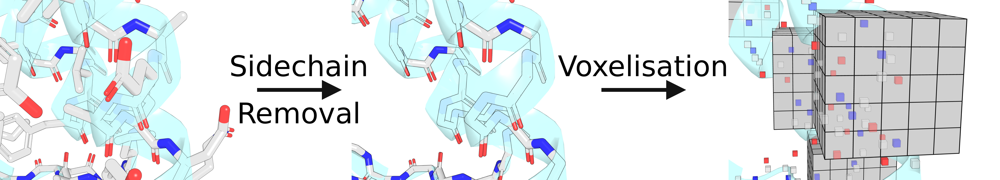

<div align="center">
  <br>
  <h3>Protein Structures Voxelisation for Deep Learning</h3><br>
</div>


[aposteriori](https://github.com/wells-wood-research/aposteriori) is a library for the voxelization of protein structures for protein design. It uses conventional PDB files to create fixed discretized areas of space called "frames". The atoms belonging to the side-chain of the residues are removed so to allow a Deep Learning classifier to determine the identity of the frames based solely on the protein backbone structure. 

<div align="center">
  <br>
</div>

## Installation

### PyPI

_Coming soon..._

```sh
pip install aposteriori
```

### Manual Install

Change directory to the aposteriori folder if you have not done so already:

```sh
git clone https://github.com/wells-wood-research/aposteriori/tree/master
cd aposteriori/
```
Install aposteriori

```sh
pip install .
```
## Creating a Dataset

There are two ways to create a dataset using `aposteriori`: through the Python API in
`aposteriori.make_frame_dataset` or using the command line tool `make-frame-dataset` that
installs along side the module:

```sh
make-frame-dataset /path/to/folder
```

If you want to try out an example, run: 
```sh
make-frame-dataset tests/testing_files/pdb_files/
```

Check the `make-frame-dataset` help page for more details on its usage:

```sh
Usage: make-frame-dataset [OPTIONS] STRUCTURE_FILE_FOLDER

  Creates a dataset of voxelized amino acid frames.

  A frame refers to a region of space around an amino acid. For every
  residue in the input structure(s), a cube of space around the region (with
  an edge length equal to `--frame_edge_length`, default 12 Å), will be
  mapped to discrete space, with a defined number of voxels per edge (equal
  to `--voxels-per-side`, default = 21).

  Basic Usage:

  `make-frame-dataset $path_to_folder_with_pdb/`

  eg. `make-frame-dataset tests/testing_files/pdb_files/`

  This command will make a tiny dataset in the current directory
  `test_dataset.hdf5`, containing all residues of the structures in the
  folder.

  Globs can be used to define the structure files to be processed. `make-
  frame-dataset pdb_files/**/*.pdb` would include all `.pdb` files in all
  subdirectories of the `pdb_files` directory.

  You can process gzipped pdb files, but the program assumes that the format
  of the file name is similar to `1mkk.pdb.gz`. If you have more complex
  requirements than this, we recommend using this library directly from
  Python rather than through this CLI.

  The hdf5 object itself is like a Python dict. The structure is simple:
  
    └─[pdb_code] Contains a number of subgroups, one for each chain.
      └─[chain_id] Contains a number of subgroups, one for each residue.
        └─[residue_id] voxels_per_side^3 array of ints, representing element number.
          └─.attrs['label'] Three-letter code for the residue.
          └─.attrs['encoded_residue'] One-hot encoding of the residue.
    └─.attrs['make_frame_dataset_ver']: str - Version used to produce the dataset.
    └─.attrs['frame_dims']: t.Tuple[int, int, int, int] - Dimentsions of the frame.
    └─.attrs['atom_encoder']: t.List[str] - Lables used for the encoding (eg, ["C", "N", "O"]).
    └─.attrs['encode_cb']: bool - Whether a Cb atom was added at the avg position of (-0.741287356, -0.53937931, -1.224287356).
    └─.attrs['atom_filter_fn']: str - Function used to filter the atoms in the frame.
    └─.attrs['residue_encoder']: t.List[str] - Ordered list of residues corresponding to the encoding used.
    └─.attrs['frame_edge_length']: float - Length of the frame in Angstroms (A)
    └─.attrs['voxels_as_gaussian']: bool - Whether the voxels are encoded as a floating point of a gaussian (True) or boolean (False)

  So hdf5['1ctf']['A']['58'] would be an array for the voxelized.

Options:
Options:
  -o, --output-folder PATH        Path to folder where output will be written.
                                  Default = `.`

  -n, --name TEXT                 Name used for the dataset file, the `.hdf5`
                                  extension does not need to be included as it
                                  will be appended. Default = `frame_dataset`

  -e, --extension TEXT            Extension of structure files to be included.
                                  Default = `.pdb`.

  --pieces-filter-file PATH       Path to a Pieces format file used to filter
                                  the dataset to specific chains inspecific
                                  files. All other PDB files included in the
                                  input will be ignored.

  --frame-edge-length FLOAT       Edge length of the cube of space around each
                                  residue that will be voxelized. Default =
                                  12.0 Angstroms.

  --voxels-per-side INTEGER       The number of voxels per side of the frame.
                                  This will give a final cube of `voxels-per-
                                  side`^3. Default = 21.

  -p, --processes INTEGER         Number of processes to be used to create the
                                  dataset. Default = 1.

  -z, --is_pdb_gzipped            If True, this flag indicates that the
                                  structure files are gzipped. Default =
                                  False.

  -r, --recursive                 If True, all files in all subfolders will be
                                  processed.

  -v, --verbose                   Sets the verbosity of the output, use `-v`
                                  for low level output or `-vv` for even more
                                  information.

  -cb, --encode_cb BOOLEAN        Encode the Cb at an average position
                                  (-0.741287356, -0.53937931, -1.224287356) in
                                  the aligned frame, even for Glycine
                                  residues. Default = True

  -ae, --atom_encoder [CNO|CNOCB|CNOCBCA]
                                  Encodes atoms in different channels,
                                  depending on atom types. Default is CNO,
                                  other options are ´CNOCB´ and `CNOCBCA` to
                                  encode the Cb or Cb and Ca in different
                                  channels respectively.  [required]

  -d, --download_file PATH        Path to csv file with PDB codes to be
                                  voxelised. The biological assembly will be
                                  used for download. PDB codes will be
                                  downloaded the /pdb/ folder.

  -g, --voxels_as_gaussian BOOLEAN
                                  Boolean - whether to encode voxels as
                                  gaussians (True) or voxels (False). The
                                  gaussian representation uses the
                                  wanderwaal's radius of each atom using the
                                  formula e^(-x^2) where x is Vx - x)^2 + (Vy
                                  - y)^2) + (Vz - z)^2)/ r^2 and  (Vx, Vy, Vz)
                                  is the position of the voxel in space. (x,
                                  y, z) is the position of the atom in space,
                                  r is the Van der Waal’s radius of the atom.
                                  They are then normalized to add up to 1.

  -b, --blacklist_csv PATH        Path to csv file with structures to be
                                  removed.

  -comp, --compression_gzip BOOLEAN
                                  Whether to comrpess the dataset with gzip
                                  compression.

  -vas, --voxelise_all_states BOOLEAN
                                  Whether to voxelise only the first state of
                                  the NMR structure (False) or all of them
                                  (True).

  -rot, --tag_rotamers BOOLEAN    Whether to tag rotamer information to the
                                  frame (True) or not (False).

  --help                          Show this message and exit.

```

### Example 1: Create a Dataset Using Biological Units of Proteins

Ideally, if you are trying to solve the Inverse Protein Folding Problem
, you should use Biological Units as they are the minimal functional part of
 a protein. This prevents having solvent-exposed hydrophobic residues as
  training data. 
  
Download the dataset: 
- ftp://ftp.ebi.ac.uk/pub/databases/pdb/data/biounit/PDB (European Server)
Alternative servers are available here (https://www.wwpdb.org/ftp/pdb-ftp-sites)

To read more about biological units: https://pdbj.org/help/about-aubu and 
https://pdb101.rcsb.org/learn/guide-to-understanding-pdb-data/biological-assemblies

Once the dataset is downloaded, you will have a directory with sub-directory
 containig the gzipped PDB structures (ie. your Protein Data Bank Files). 
 
To voxelize the structures into frames, run:

```sh
make-frame-dataset /path/to/biounits/  -e .pdb1.gz 
```
  
If everything went well, you should be seeing the number of structures that
 will be voxelised and a list of default parameters, to which you will press "y
 " to proceed. 
 

### Example 2: Create a Dataset Using Biological Units of Proteins and PISCES

PISCES (Protein Sequence Culling Server) is a curated subset of protein
 structures. Each file contains a list of structures with parameters such as
  resolution, percentage identity and R-Values. 
  
Aposteriori supports filtering with a PISCES file as such:
 
```sh
make-frame-dataset /path/to/biounits/  -e .pdb1.gz --pieces-filter-file
 path/to/pisces/cullpdb_pc90_res1.6_R0.25_d190114_chains8082
```
  
If everything went well, you should be seeing the number of structures that
 will be voxelised and a list of default parameters, to which you will press "y
 " to proceed. 

## Development

The easiest way to install a development version of `aposteriori` is using Conda:


### Conda

Create the environment:

```shell
conda create -n aposteriori python=3.8
```

Activate it and clone the repository:

```shell
conda activate aposteriori
git clone https://github.com/wells-wood-research/aposteriori.git
cd aposteriori/
```

Install dependencies:

```sh
pip install -r dev-requirements.txt
```

Install aposteriori:

```shell
pip install .
```
Check that aposteriori works

```sh
 make-frame-dataset --help
```

Make sure you test your install:

```sh
pytest tests/
```


### Pip (only)

Alternatively you can install the repository with pip:

```shell
git clone https://github.com/wells-wood-research/aposteriori.git
cd aposteriori/
pip install -r dev-requirements.txt
```

Install aposteriori:

```shell
pip install .
```