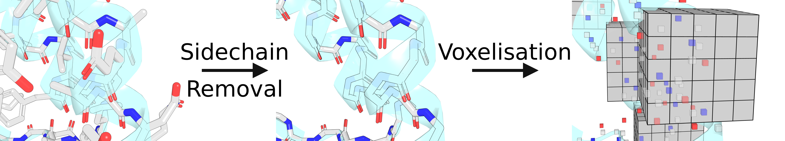

<div align="center">
  <br>
  <h3>Protein Structures Voxelisation for Deep Learning</h3><br>
</div>


[aposteriori](https://github.com/wells-wood-research/aposteriori) is a library for the voxelization of protein structures for protein design. It uses conventional PDB files to create fixed discretized areas of space called "frames". The atoms belonging to the side-chain of the residues are removed so to allow a Deep Learning classifier to determine the identity of the frames based solely on the protein backbone structure. 

<div align="center">
  <br>
</div>

## Installation

### PyPI

```sh
pip install aposteriori
```

### Manual Install

Clone the repository and install manually:

```sh
git clone https://github.com/wells-wood-research/aposteriori.git
cd aposteriori/
pip install .
```

## Creating a Dataset


You can create a dataset using `aposteriori` in two ways:
- **Python API**: `aposteriori.make_frame_dataset`
- **Command-Line Interface (CLI)**: `make-frame-dataset`

```sh
make-frame-dataset /path/to/pdb_folder
```

If you want to try out an example, run: 
```sh
make-frame-dataset tests/testing_files/pdb_files/
```

To view all options:
```sh
make-frame-dataset --help
```

To predict the identity of a frame, you can use several models from [TIMED-Design](https://raw.githubusercontent.com/wells-wood-research/timed-design).


## Understanding the Dataset Format

The resulting dataset is stored in an HDF5 file and follows this structure:

```
└── [PDB Code]  # Each protein structure
    └── [Chain ID]  # Each chain in the structure
        └── [Residue ID]  # Each residue as a voxelized 3D frame
            ├── Voxel Data (NxNxNxC array)
            ├── .attrs['label']  # Residue three-letter code
            ├── .attrs['encoded_residue']  # One-hot encoded residue identity
└── .attrs['make_frame_dataset_ver']  # Version info
└── .attrs['frame_dims']  # Voxel grid dimensions
└── .attrs['atom_encoder']  # Atom encoding scheme
└── .attrs['frame_edge_length']  # Frame size in Å
└── .attrs['voxels_as_gaussian']  # Whether voxels store Gaussian density maps
```

```python
import h5py
with h5py.File("frame_dataset.hdf5", "r") as dataset:
    frame = dataset["1CTF"]["A"]["58"][:]  # Get voxelized frame
```

## Command-Line Options

```shell
make-frame-dataset [OPTIONS] STRUCTURE_FILE_FOLDER
```

### Key Options
| Option | Description |
|--------|-------------|
| `-o, --output-folder PATH` | Output directory (default: current) |
| `-n, --name TEXT` | Dataset name (default: `frame_dataset.hdf5`) |
| `-e, --extension TEXT` | File extension to process (default: `.pdb`) |
| `--frame-edge-length FLOAT` | Frame size in Å (default: `12.0`) |
| `--voxels-per-side INTEGER` | Voxel grid size (default: `21`) |
| `-p, --processes INTEGER` | Number of parallel processes (default: `1`) |
| `-g, --voxels_as_gaussian BOOLEAN` | Store as Gaussian densities instead of binary (default: `False`) |
| `-b, --blacklist_csv PATH` | Exclude structures in a CSV file |
| `-d, --download_file PATH` | Download PDB structures from a CSV list |
| `-r, --recursive` | Include subdirectories |


## Examples

### Example 1: Create a Dataset Using a Folder of PDBs

```sh
make-frame-dataset tests/testing_files/pdb_files/
```

### Example 2: Create a Dataset Using Biological Units of Proteins

Biological Units are functionally relevant protein structures that avoid artifacts like solvent-exposed hydrophobic residues.

```sh
make-frame-dataset /path/to/biounits/ -r 
```

In this case the recursive flag `-r` tells aposteriori to look in subfolders. 

Download the datasets from: 
- [European Bioinformatics Institute](ftp://ftp.ebi.ac.uk/pub/databases/pdb/data/biounit/PDB)
- [Alternative Sources](https://www.wwpdb.org/ftp/pdb-ftp-sites)


For more details, see:
- [Understanding Biological Units](https://pdb101.rcsb.org/learn/guide-to-understanding-pdb-data/biological-assemblies)


### Example 3: Create a Dataset Using Biological Units of Proteins and PISCES

[PISCES](http://dunbrack.fccc.edu/pisces/) provides curated protein subsets based on resolution, identity, and quality.
  
To voxelize structures from a PISCES file:
 
```sh
make-frame-dataset /path/to/biounits/ --pieces-filter-file path/to/pisces/cullpdb_pc90_res1.6_R0.25_d190114_chains8082
```

## Development

The easiest way to install a development version of `aposteriori` is using Conda:

Create and activate a development environment:

```shell
conda create -n aposteriori python=3.8
conda activate aposteriori
```

Clone and install dependencies:
```shell
git clone https://github.com/wells-wood-research/aposteriori.git
cd aposteriori/
pip install -r dev-requirements.txt
pip install .
```

Run tests:
```
pytest tests/
```

### Checking CLI Installation
...
make-frame-dataset --help
...

---

## Citing Aposteriori
If you use `aposteriori` in your research, please cite it appropriately.

```
@article{timed,
    author = {Castorina, Leonardo V and Ünal, Suleyman Mert and Subr, Kartic and Wood, Christopher W},
    title = "{TIMED-Design: Flexible and Accessible Protein Sequence Design with Convolutional Neural Networks}",
    journal = {Protein Engineering, Design and Selection},
    pages = {gzae002},
    year = {2024},
    month = {01},
    abstract = "{Sequence design is a crucial step in the process of designing or engineering proteins. Traditionally, physics-based methods have been used to solve for optimal sequences, with the main disadvantages being that they are computationally intensive for the end user. Deep learning based methods offer an attractive alternative, outperforming physics-based methods at a significantly lower computational cost.In this paper, we explore the application of Convolutional Neural Networks (CNNs) for sequence design. We describe the development and benchmarking of a range of networks, as well as reimplementations of previously described CNNs. We demonstrate the flexibility of representing proteins in a three-dimensional voxel grid by encoding additional design constraints into the input data. Finally, we describe TIMED-Design, a web application and command line tool for exploring and applying the models described in this paper.The User Interface (UI) will be available at the URL: https://pragmaticproteindesign.bio.ed.ac.uk/timed. The source code for TIMED-Design is available at https://github.com/wells-wood-research/timed-design.chris.wood@ed.ac.ukSupplementary data are available at Journal Name online.}",
    issn = {1741-0126},
    doi = {10.1093/protein/gzae002},
    url = {https://doi.org/10.1093/protein/gzae002},
    eprint = {https://academic.oup.com/peds/advance-article-pdf/doi/10.1093/protein/gzae002/56453873/gzae002.pdf},
}
```